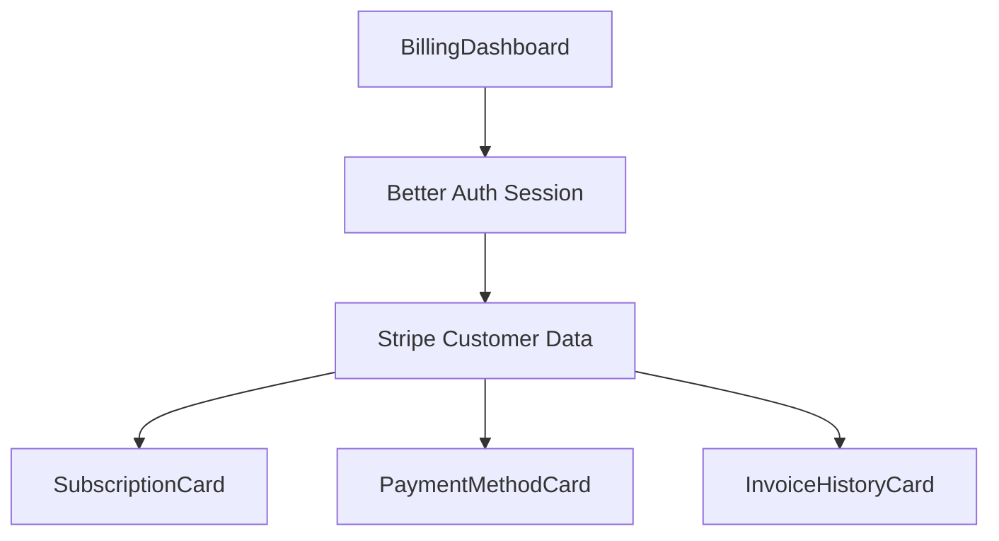

import { Callout } from 'fumadocs-ui/components/callout';
import { Tab, Tabs } from 'fumadocs-ui/components/tabs';
import { TypeTable } from 'fumadocs-ui/components/type-table';

# BillingDashboard

The `BillingDashboard` component provides a complete billing management interface combining subscription details, payment methods, and invoice history in a single, composable view.

<Callout type="info">
  This component is backend-agnostic and works with any Better Auth backend. You provide the authClient and handle callbacks.
</Callout>

## Installation

```tsx
import { BillingDashboard } from '@bettercone/ui';
```

## Features

- ✅ **Backend-Agnostic** - Works with any Better Auth backend (Convex, Prisma, Supabase, Drizzle)
- ✅ **Subscription Overview** - Current plan, status, renewal date, and upgrade options
- ✅ **Payment Methods** - Manage payment methods via Stripe portal
- ✅ **Invoice History** - View and download past invoices
- ✅ **Responsive Layout** - Grid or stack layout options
- ✅ **Fully Customizable** - Control over styling and text with classNames and localization
- ✅ **Type-Safe** - Complete TypeScript support with proper interfaces

## Usage

<Tabs items={['Basic', 'With Callbacks', 'Grid Layout', 'Custom Styling']}>
  <Tab value="Basic">
    ```tsx
    import { BillingDashboard } from '@bettercone/ui';
    import { authClient } from '@/lib/auth-client';

    export default function BillingPage() {
      const handleManageSubscription = async (subscription, organization) => {
        const response = await fetch("/api/billing/portal", {
          method: "POST",
          body: JSON.stringify({ organizationId: organization?.id })
        });
        const { url } = await response.json();
        window.location.href = url;
      };

      return (
        <div className="container mx-auto py-8">
          <h1 className="text-3xl font-bold mb-6">Billing</h1>
          <BillingDashboard 
            authClient={authClient}
            subscriptionCardProps={{
              onManageSubscription: handleManageSubscription
            }}
          />
        </div>
      );
    }
    ```
  </Tab>
  
  <Tab value="With Callbacks">
    ```tsx
    import { BillingDashboard } from '@bettercone/ui';
    import { authClient } from '@/lib/auth-client';
    import { useRouter } from 'next/navigation';

    export default function BillingPage() {
      const router = useRouter();

      const handleManageSubscription = async (subscription, organization) => {
        const response = await fetch("/api/billing/portal");
        const { url } = await response.json();
        window.location.href = url;
      };

      return (
        <div className="container mx-auto py-8">
          <h1 className="text-3xl font-bold mb-6">Billing</h1>
          
          <BillingDashboard 
            authClient={authClient}
            subscriptionCardProps={{
              onManageSubscription: handleManageSubscription,
              onAction: (action) => {
                if (action === 'upgrade') {
                  router.push('/pricing');
                }
              }
            }}
            paymentMethodCardProps={{
              onManagePayment: handleManageSubscription
            }}
            invoiceHistoryCardProps={{
              onViewInvoices: handleManageSubscription,
              maxInvoices: 5
            }}
          />
        </div>
      );
    }
    ```
  </Tab>
  
  <Tab value="Stack Layout">
    ```tsx
    import { BillingDashboard } from '@/components';

    export default function BillingPage() {
      return (
        <div className="container mx-auto py-8">
          <h1 className="text-3xl font-bold mb-6">Billing</h1>
          
          {/* Stack layout - single column */}
          <BillingDashboard layout="stack" />
        </div>
      );
    }
    ```
  </Tab>
  
  <Tab value="Custom Styling">
    ```tsx
    import { BillingDashboard } from '@/components';

    export default function BillingPage() {
      return (
        <div className="container mx-auto py-8">
          <h1 className="text-3xl font-bold mb-6">Billing</h1>
          
          <BillingDashboard 
            className="max-w-6xl mx-auto"
            classNames={{
              container: "space-y-8",
              grid: "gap-8",
              subscriptionCard: "border-2 border-primary",
              paymentCard: "shadow-lg",
              invoiceCard: "shadow-lg"
            }}
          />
        </div>
      );
    }
    ```
  </Tab>
</Tabs>

## Props

<TypeTable
  type={{
    className: {
      type: 'string',
      description: 'Additional CSS classes for the root container',
    },
    classNames: {
      type: 'object',
      description: 'Granular styling control for child elements',
      properties: {
        container: 'string - Root container classes',
        grid: 'string - Grid/stack layout classes',
        subscriptionCard: 'string - Subscription card classes',
        paymentCard: 'string - Payment method card classes',
        invoiceCard: 'string - Invoice history card classes',
      },
    },
    localization: {
      type: 'Partial<BillingLocalization>',
      description: 'Custom text labels for internationalization',
    },
    layout: {
      type: '"grid" | "stack"',
      default: '"grid"',
      description: 'Layout mode: grid (2 columns) or stack (single column)',
    },
  }}
/>

## Layout Options

The `BillingDashboard` supports two layout modes:

### Grid Layout (Default)

The grid layout displays cards in a responsive grid:
- Subscription card spans full width
- Payment and invoice cards split into 2 columns on desktop
- Stacks vertically on mobile

```tsx
<BillingDashboard layout="grid" />
```

### Stack Layout

The stack layout displays all cards in a single column:

```tsx
<BillingDashboard layout="stack" />
```

## Localization

Customize all text labels for internationalization:

```tsx
import { BillingDashboard } from '@/components';

export default function BillingPage() {
  return (
    <BillingDashboard 
      localization={{
        // Subscription Card
        subscription: {
          title: 'Assinatura',
          plan: 'Plano',
          status: 'Status',
          nextBilling: 'Próxima cobrança',
          upgrade: 'Fazer upgrade',
          manage: 'Gerenciar assinatura',
        },
        // Payment Methods
        paymentMethods: {
          title: 'Métodos de pagamento',
          addNew: 'Adicionar novo',
          setDefault: 'Definir como padrão',
          remove: 'Remover',
        },
        // Invoices
        invoices: {
          title: 'Histórico de faturas',
          download: 'Baixar',
          date: 'Data',
          amount: 'Valor',
          status: 'Status',
        },
      }}
    />
  );
}
```

## Examples

### Example 1: Protected Billing Page

```tsx
'use client';

import { BillingDashboard } from '@/components';
import { SignedIn, SignedOut } from '@daveyplate/better-auth-ui';
import { Button } from '@/components/ui/button';
import Link from 'next/link';

export default function BillingPage() {
  return (
    <div className="container mx-auto py-8 px-4">
      <SignedOut>
        <div className="text-center py-12">
          <h1 className="text-2xl font-bold mb-4">Sign in to manage billing</h1>
          <Button asChild>
            <Link href="/auth/sign-in">Sign In</Link>
          </Button>
        </div>
      </SignedOut>

      <SignedIn>
        <div className="mb-8">
          <h1 className="text-3xl font-bold mb-2">Billing & Subscription</h1>
          <p className="text-muted-foreground">
            Manage your subscription, payment methods, and invoices
          </p>
        </div>

        <BillingDashboard />
      </SignedIn>
    </div>
  );
}
```

### Example 2: With Loading State

```tsx
'use client';

import { BillingDashboard } from '@/components';
import { SignedIn } from '@daveyplate/better-auth-ui';
import { Suspense } from 'react';
import { Skeleton } from '@/components/ui/skeleton';

function BillingDashboardSkeleton() {
  return (
    <div className="space-y-6">
      <Skeleton className="h-48 w-full" />
      <div className="grid gap-6 md:grid-cols-2">
        <Skeleton className="h-64 w-full" />
        <Skeleton className="h-64 w-full" />
      </div>
    </div>
  );
}

export default function BillingPage() {
  return (
    <SignedIn>
      <div className="container mx-auto py-8">
        <h1 className="text-3xl font-bold mb-6">Billing</h1>
        
        <Suspense fallback={<BillingDashboardSkeleton />}>
          <BillingDashboard />
        </Suspense>
      </div>
    </SignedIn>
  );
}
```

### Example 3: Embedded in Settings

```tsx
import { BillingDashboard } from '@/components';
import { Tabs, TabsContent, TabsList, TabsTrigger } from '@/components/ui/tabs';

export default function SettingsPage() {
  return (
    <div className="container mx-auto py-8">
      <h1 className="text-3xl font-bold mb-6">Settings</h1>
      
      <Tabs defaultValue="billing">
        <TabsList>
          <TabsTrigger value="account">Account</TabsTrigger>
          <TabsTrigger value="billing">Billing</TabsTrigger>
          <TabsTrigger value="team">Team</TabsTrigger>
        </TabsList>
        
        <TabsContent value="billing" className="mt-6">
          <BillingDashboard layout="stack" />
        </TabsContent>
        
        {/* Other tabs... */}
      </Tabs>
    </div>
  );
}
```

### Example 4: Custom Styling with Theme

```tsx
import { BillingDashboard } from '@/components';

export default function PremiumBillingPage() {
  return (
    <div className="container mx-auto py-8">
      <div className="mb-8 text-center">
        <h1 className="text-4xl font-bold bg-linear-to-r from-blue-600 to-purple-600 bg-clip-text text-transparent mb-2">
          Premium Billing
        </h1>
        <p className="text-muted-foreground">
          Exclusive features for premium members
        </p>
      </div>

      <BillingDashboard 
        className="max-w-5xl mx-auto"
        classNames={{
          container: "space-y-8",
          subscriptionCard: "border-2 border-purple-500 shadow-xl",
          paymentCard: "border border-blue-200 shadow-lg hover:shadow-xl transition-shadow",
          invoiceCard: "border border-blue-200 shadow-lg hover:shadow-xl transition-shadow",
        }}
        layout="grid"
      />
    </div>
  );
}
```

## Component Composition

The `BillingDashboard` is composed of three main cards:

1. **SubscriptionCard** - Displays current plan and subscription status
2. **PaymentMethodCard** - Manages payment methods
3. **InvoiceHistoryCard** - Lists invoice history

You can also use these cards individually for more granular control:

```tsx
import { 
  SubscriptionCard,
  PaymentMethodCard,
  InvoiceHistoryCard 
} from '@/components';

export default function CustomBillingPage() {
  return (
    <div className="space-y-6">
      {/* Use only the cards you need */}
      <SubscriptionCard />
      
      <div className="grid gap-6 lg:grid-cols-3">
        <div className="lg:col-span-2">
          <InvoiceHistoryCard />
        </div>
        <PaymentMethodCard />
      </div>
    </div>
  );
}
```

## Data Flow



The component automatically:
1. Fetches the current user session
2. Retrieves Stripe customer data
3. Displays subscription, payment methods, and invoices
4. Handles loading and error states

<Callout type="info">
  No manual data fetching required! The component handles all data operations internally.
</Callout>

## Notes

<Callout type="warning">
  **Stripe Setup Required:** This component requires a properly configured Stripe integration. See the [Stripe Integration Guide](/docs/guides/stripe-integration).
</Callout>

- All data updates happen in real-time through Convex
- Payment method changes are immediately reflected
- Invoice downloads are handled securely through Stripe
- Supports all Stripe-supported payment methods

## Related Components

- [SubscriptionCard](/docs/components/billing/subscription-card) - Standalone subscription details
- [PaymentMethodCard](/docs/components/billing/payment-method-card) - Payment method management
- [InvoiceHistoryCard](/docs/components/billing/invoice-history-card) - Invoice list
- [PricingDashboard](/docs/components/pricing/pricing-dashboard) - Display pricing plans

## Next Steps

- [Set up Stripe integration](/docs/guides/stripe-integration)
- [Learn about subscription management](/docs/guides/subscription-management)
- [View complete billing example](/docs/examples/billing-page)
- [Explore pricing components](/docs/components/pricing)
